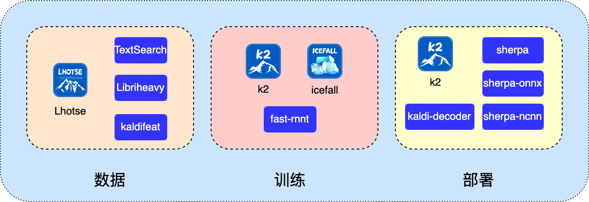
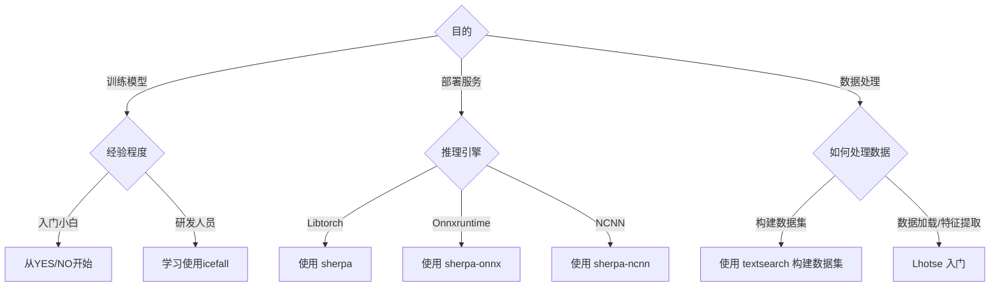

# 新一代 Kaldi

新一代 Kaldi 是一个开源的智能语音工具集，几乎涵盖了构建智能语音系统的方方面面。

# 你的角色？

``` mermaid
graph TD
  A{目的} --> |训练模型| C{经验程度};
  A --> |部署服务| D{推理引擎};
  A --> |数据处理| B{如何处理数据};
  C --> |入门小白| G[从YES/NO开始];
  C --> |研发人员| H[学习使用icefall];
  D --> |Libtorch| I[使用 sherpa];
  D --> |Onnxruntime| J[使用 sherpa-onnx];
  D --> |NCNN| K[使用 sherpa-ncnn];
  B --> |构建数据集| E[使用 textsearch 构建数据集];
  B --> |数据加载/特征提取| F[Lhotse 入门];
```

